# GSoC 2025 – Enhanced Dual Contouring for Manifold Isosurfacing

## 1. Overview

I participated in **Google Summer of Code 2025** with **[CGAL](https://www.cgal.org/)**, working on the development and implementation of
robust methods for **2-manifold isosurface extraction** in the `Isosurfacing_3` package.
The goal of this project was to enhance CGAL’s dual contouring–based isosurfacing methods so that the
generated surfaces are **topologically correct**, with particular emphasis on eliminating
nonmanifold edges and vertices.

This project focused on the uniform voxel grid setting, establishing a robust and
well-understood foundation before extending the methods to adaptive octree meshes.

---

## 2. Background and Motivation

Dual Contouring (DC) is a classical isosurface extraction technique that constructs surface
meshes using Hermite data sampled on grid edges. While DC is efficient and flexible, a major
limitation is that it can generate **nonmanifold surfaces**, which are problematic for
downstream geometry processing and simulation.

Several extensions of DC have been proposed to address this issue. In particular,
**Manifold Dual Contouring (MDC)**, introduced by Schaefer, Ju, and Warren, enforces manifold
constraints using vertex clustering and topological checks. In the uniform grid setting,
MDC reduces to **Dual Marching Cubes (DMC)**, which constructs meshes using polygonal patches
derived from the marching cubes lookup table.

However, during implementation and testing, I observed that:
- Classical DC frequently produces nonmanifold edges and vertices.
- DMC significantly improves robustness but **does not guarantee global manifoldness**.
- Even when using topologically correct marching cubes (TMC), **tunnel-like configurations**
  can still introduce nonmanifold edges.

These observations motivated a deeper investigation into the precise sources of
nonmanifoldness and the design of targeted post-processing strategies.

  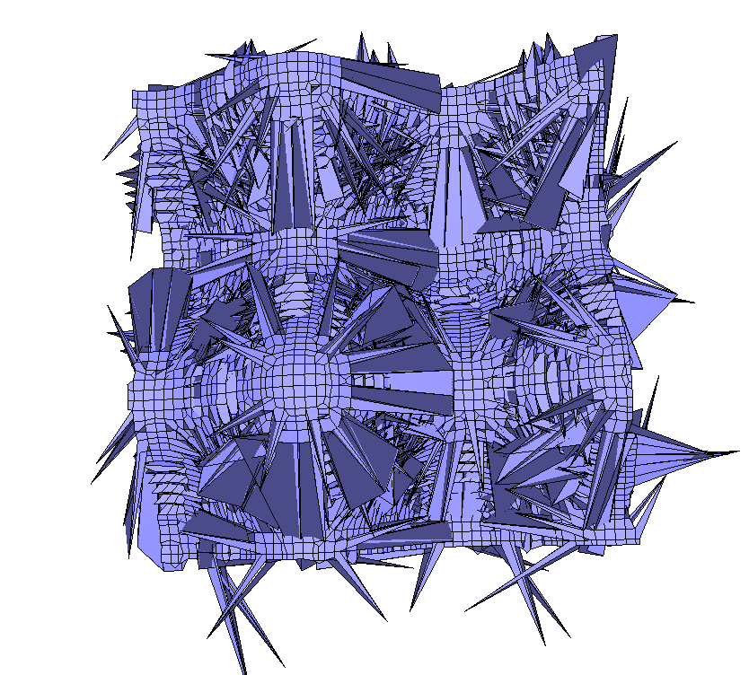
  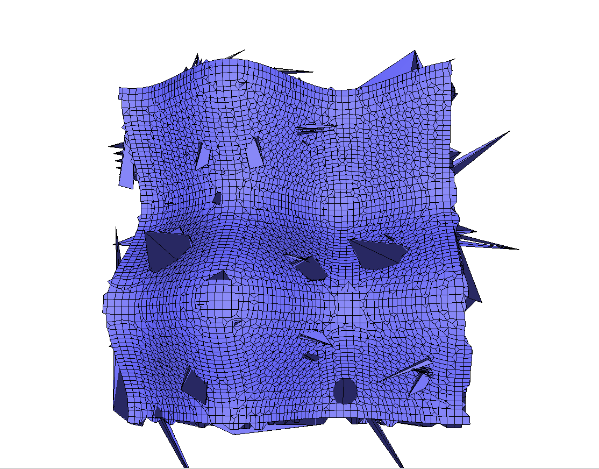
  
  

**Figure 1.** (Top) Comparison of DC (left) and DMC (right)
using QEM-based dual vertex placement on a sample mesh. DMC reduces nonmanifold artifacts but they still exist.
(Bottom) Visualization of nonmanifold edges (highlighted in red). 

---

## 3. Project Roadmap

The project followed a three-stage progression:

1. **Implementation of Dual Marching Cubes (DMC)** as a baseline pipeline.
2. **Integration of Topologically Correct Marching Cubes (TMC)** to handle ambiguous
   marching cubes configurations (e.g., MC case 105).
3. **Automated resolution of nonmanifold edges** using graph-based post-processing inspired
   by the method of Zint, Grosso, and Gürtler (https://diglib.eg.org/server/api/core/bitstreams/561b6de0-f239-478a-8ae0-717bb42aec3b/content) in the case when tunnels are generated with the TMC look-up table.

Each stage revealed new failure modes and informed subsequent design decisions.

---

## 4. Dual Marching Cubes Implementation

I first implemented a complete **Dual Marching Cubes** pipeline within CGAL. Key components
include:

- Construction of polygonal patches from the marching cubes lookup table.
- Computation of dual vertices per patch using both:
  - **QEM-based placement**, and
  - **Patch-centroid placement**.
- Construction of an `edge_to_dual_vertices` mapping to ensure quads are generated in a
  consistent local cyclic order.
- Generation of quad faces by traversing grid edges.

During this stage, several subtle bugs were identified and fixed, including:
- Incorrect handling of vertex indices in polygon soups.
- Inconsistent local cyclic ordering of quad vertices.
- Global orientation inconsistencies across edges.
- Failure to deduplicate quads, leading to hidden nonmanifold artifacts.

Extensive testing demonstrated that DMC significantly reduces nonmanifold artifacts compared
to classical DC, but does not eliminate them entirely.

---

## 5. Ambiguous Cases and TMC–DMC Integration

Certain nonmanifold configurations arise from **ambiguous marching cubes cases**, most
notably MC case 105. CGAL already provides a **Topologically Correct Marching Cubes (TMC)**
implementation that resolves these ambiguities at the triangle level.

To leverage this capability, I integrated TMC into the DMC pipeline:

- The TMC `p_slice` routine was exposed and reused to post-process ambiguous cases.
- TMC-generated triangles were reassembled into polygonal patches compatible with DMC.
- Edge–patch correspondence was reconstructed by matching intersection points to grid edges.

This **TMC–DMC hybrid** successfully eliminated a large class of nonmanifold surfaces.
However, it introduced new challenges:
- Missing dual vertices in certain cells caused holes in the mesh.
- These holes were traced to incorrect edge–patch associations and fixed using robust
  point-on-segment checks.

Despite these improvements, systematic testing revealed that **tunnel configurations**
still generate nonmanifold edges even under TMC–DMC.

  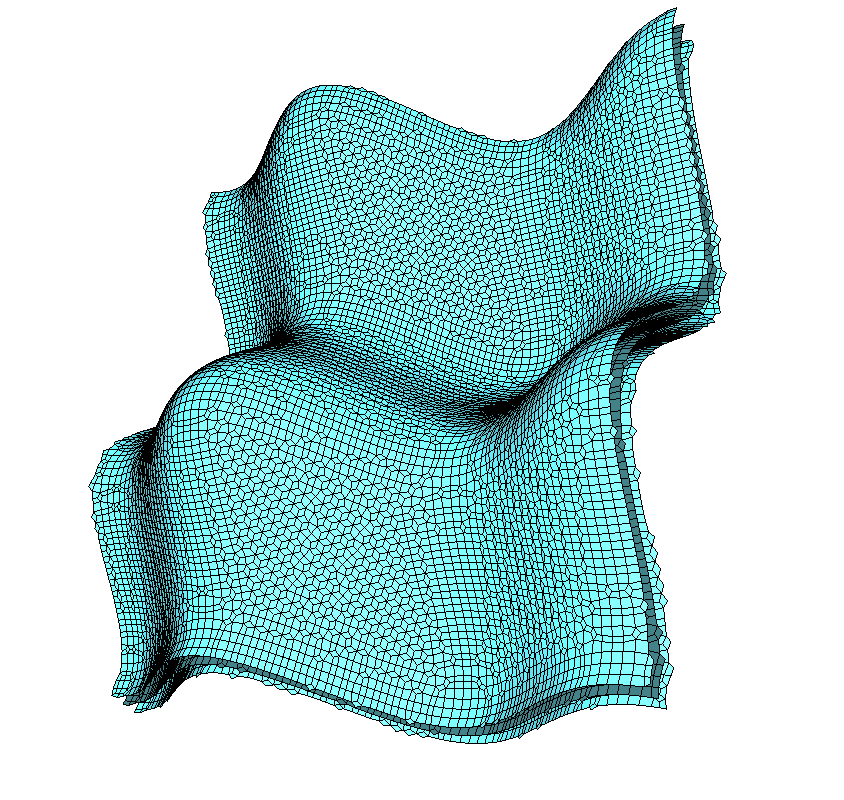

**Figure 2.** Result of the TMC–DMC pipeline after resolving ambiguous marching cubes
configurations. The mesh is free of ambiguity-induced nonmanifold artifacts, though
tunnel-induced nonmanifold edges may still be present.

---

## 6. Analysis of Nonmanifold Edge Sources

To better understand the remaining failure modes, I instrumented the pipeline to classify
the origin of each dual edge:

- Boundary edges (1 incident face)
- Manifold edges (2 incident faces)
- Nonmanifold edges (3 or more incident faces)

Each dual vertex was labeled according to its origin:
- Regular DMC
- TMC without tunnel formation
- TMC-induced tunnel formation

Empirical evidence across multiple datasets and resolutions showed that **nearly all
remaining nonmanifold edges originate from tunnel-generation cases** introduced by TMC.

This observation strongly suggested that a dedicated tunnel-resolution strategy was
required.

  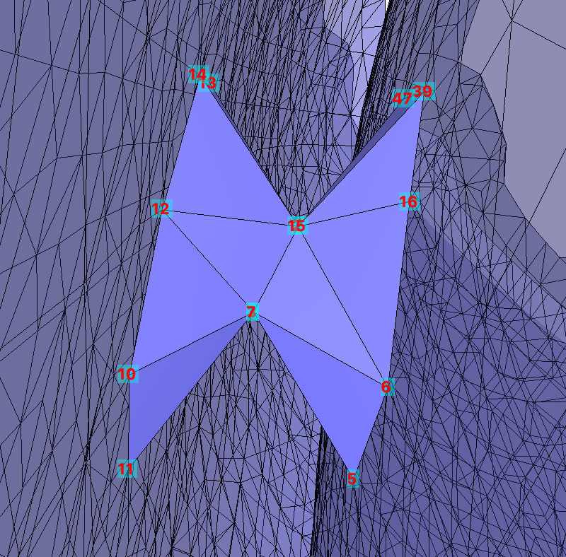
  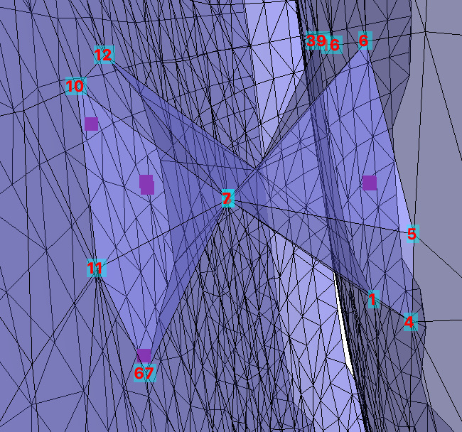

**Figure 3.** Example of a tunnel-induced nonmanifold edge configuration. Multiple surface patches intersect at a single edge, violating manifoldness. Vertex indices are shown to illustrate the local connectivity responsible for the tunnel configuration.

---

## 7. Resolving Nonmanifold Edges via Tunnel Recovery

To address tunnel-induced nonmanifold edges, I implemented an automated post-processing
algorithm inspired by:

> *Resolving Non-Manifoldness on Meshes from Dual Marching Cubes*  
> D. Zint, R. Grosso, P. Gürtler

The core idea is to **recover the tunnel structure** rather than collapsing it into a
nonmanifold edge. The implemented procedure consists of:

1. **Primal face extraction**  
   Identify the separating primal face between the two cells involved in the tunnel.

2. **Asymptotic decider–based pairing**  
   Use Nielson’s asymptotic decider to determine the correct pairing of opposite faces.

3. **Quad subdivision**  
   Subdivide incident quads into smaller quads, introducing auxiliary vertices.

4. **Incident face removal**  
   Remove faces incident to the nonmanifold edge.

5. **Vertex merging**  
   Merge dual vertices on opposite tunnel walls to recover a valid tunnel geometry.

Because the original paper leaves several steps underspecified, I made explicit design
choices (e.g., uniform subdivision, centroid-based merging) and validated them through
visualization and testing.

This procedure successfully resolves isolated and adjacent nonmanifold edges and restores
correct tunnel topology.

<!-- Row 1: algorithm steps -->

  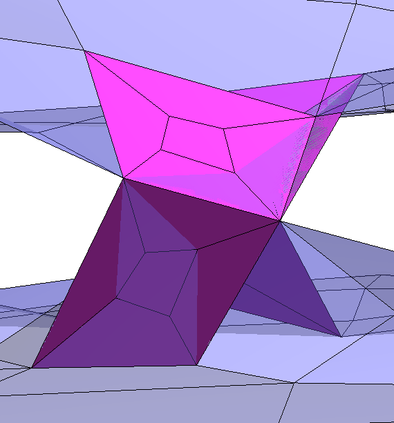
  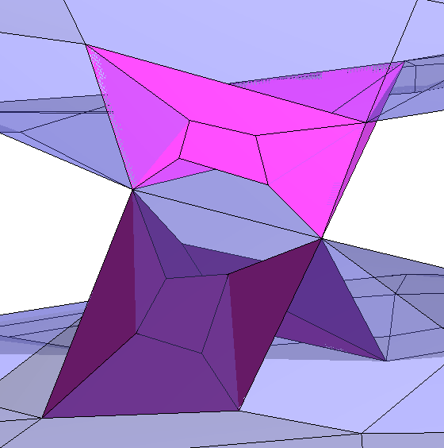
  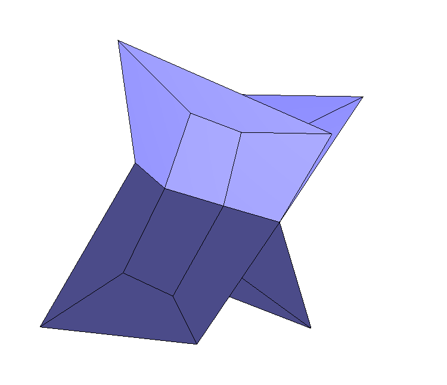

*Top row:* (Left) subdivision of incident quads; (Center) removal of conflicting
incident faces; (Right) vertex merging to restore manifold connectivity.

<!-- Row 2: before / after -->

  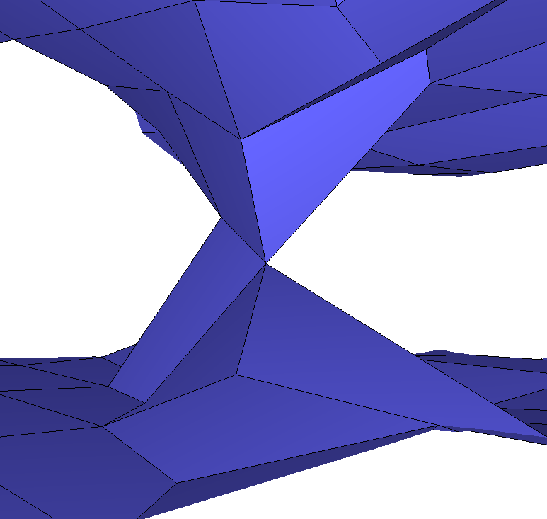
  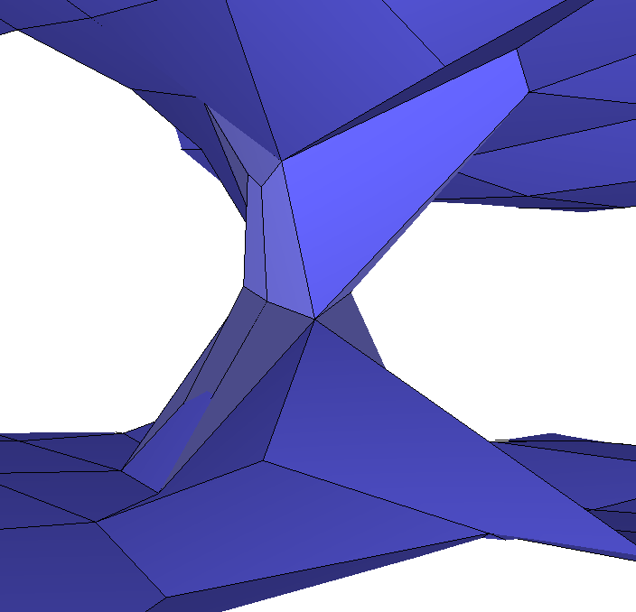

*Bottom row:* (Left) nonmanifold edge prior to recovery; (Right) resulting tunnel
structure replacing the nonmanifold edge.

**Figure 4.** Tunnel recovery procedure for resolving nonmanifold edges.

---

## 8. Handling Adjacent Nonmanifold Edges

In cases where multiple nonmanifold edges are adjacent, a naive vertex-merging strategy is
insufficient. I extended the post-processing to:

- Group multiple vertices requiring merging.
- Merge them using centroid-based strategies.
- Detect and resolve degenerate “bowtie” quads via triangulation.

This extension recovers multiple adjacent tunnels while maintaining manifoldness.

<!-- Row 1: before -->

  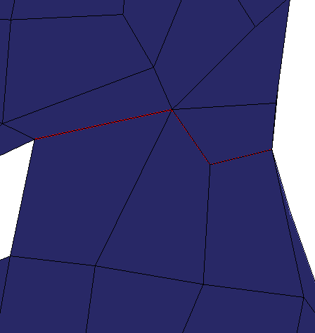
  

*Top row:* Before recovery. (Left) front view; (Right) top view.

<!-- Row 2: after -->

  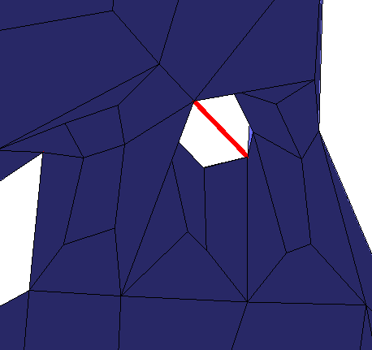
  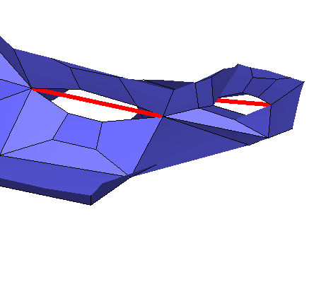

*Bottom row:* After recovery. (Left) front view; (Right) top view.
**Figure 5.** Resolution of neighboring nonmanifold edges. The top row shows the
original configuration with adjacent nonmanifold edges highlighted in red. The
bottom row shows the configuration after tunnel recovery, where nonmanifold edges
are replaced by topologically valid tunnels.

---

## 9. Nonmanifold Vertices and Boundary Padding

While the post-processing reliably resolves **nonmanifold edges**, **nonmanifold vertices
(NMVs)** may still arise, and in some cases can be introduced by the edge-resolution step.

Following suggestions in the literature, I implemented **ghost-layer padding** at the grid
boundary:
- An extra layer of voxels is added in all coordinate directions.
- Scalar values and gradients are copied from boundary cells.

This approach successfully resolves **boundary NMVs**, but:
- Does not address interior NMVs.
- Modifies the effective geometry near the boundary.

As such, it should be viewed as a partial and context-dependent solution.

---

## 10. Results and Evaluation

Across a wide range of synthetic and real-world datasets:

- DMC significantly improves robustness over classical DC.
- TMC–DMC eliminates ambiguity-induced nonmanifoldness.
- Tunnel-aware post-processing **systematically resolves nonmanifold edges**.
- Boundary padding resolves boundary NMVs but not interior ones.

The resulting meshes are consistently smoother and more topologically reliable, though
full manifold guarantees in the presence of NMVs remain an open problem.

---

## 11. Limitations and Future Work

The primary remaining challenge is the **robust resolution of nonmanifold vertices**,
particularly in interior regions. Promising future directions include:

- Extending the tunnel-recovery framework to vertex-based configurations.
- Leveraging adaptive octree refinement, where NMVs may naturally disappear.
- Integrating these methods into CGAL’s adaptive MDC pipeline.

---

## 12. Conclusion

This project establishes a robust and well-tested foundation for **manifold isosurface
extraction in CGAL**. By combining DMC, TMC, and automated tunnel recovery, it significantly
advances the practical reliability of dual contouring–based methods and lays the groundwork
for future adaptive and production-level integration.

---

## Acknowledgments

I am grateful to my GSoC mentors Mael Rouxel-Labbé, Sven Oesau, and Pierre Alliez, and the CGAL development team for their guidance,
discussions, and support throughout this project.
